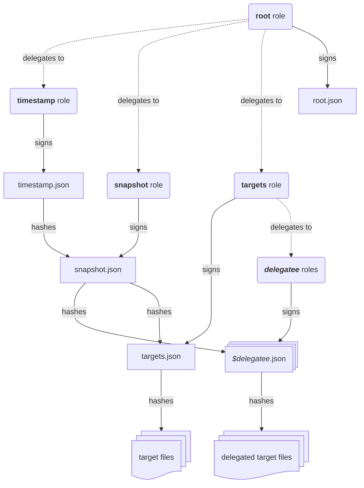

# Getting Started with Quarry #

When distributing images with Quarry, there are two key roles: *publisher* and
*client*. While Quarry has a fairly rich Go API for both of these roles, it is
simplest to get started using some of our command-line tools:

 * `hardhat` is an experimental that can be used by *publishers*. It provides
   tools for creating and manage repositories and their associated keys.
 * `quarry client` is a fairly generic [TUF][] *client* that supports our
   extensions. It primarily provides mechanisms for fetching individual and
   lists of target files.
 * `quarry sysupdate` is a more speciailised *client* built on top of
   `quarry client`. It acts as a higher-level wrapper around
   [`systemd-sysupdate`][systemd-sysupdate] for managing distribution of images
   to immutable image-based systems.

As Quarry deals only with static files, this guide will create an publish
repositories using local files and minimal web servers.

[TUF]: https://theupdateframework.io/
[systemd-sysupdate]: https://www.freedesktop.org/software/systemd/man/latest/systemd-sysupdate.html

## Background on TUF ##

TUF splits signing across four roles, each with its own keys:

* The `root` role signs the list of keys trusted for every role. Its keys are rarely
  used and should be kept offline.
* The `targets` role signs the list of target files (names, sizes, and hashes).
  Its keys are typically held by whoever builds the artefacts. The `targets`
  role can choose to delegate the signing of a subset of target files to other
  custom "delegatee" roles.
* The `snapshot` role signs a snapshot of the `targets` and any delegatee
  roles. Its keys are held by the repository publisher.
* The `timestamp` role signs the most current `snapshot` role's hash, usually
  with a very short expiry to avoid freeze attacks. Its keys are most often
  held by the repository publisher.

This diagram (shamelessly cribbed and modernised from a similar figure in [the
original TUF paper][tuf-paper]) might make the relationship between these roles
a little more clear.



Because different entities often hold these keys, `hardhat` lets you keep them
in separate keystores, allowing each process to only have access to the keys it
actually needs.

[tuf-paper]: https://theupdateframework.io/papers/survivable-key-compromise-ccs2010.pdf

## Getting Quarry ##

At the moment, Quarry needs to be built from source.

To do so with the most minimal host dependencies, you only need [`just`] and a
`buildx`-compatible container runtime and to run the following command:

```console
$ just build-all-in-container
$ export PATH="$PATH:$PWD"
```

(`export CONTAINER_ENGINE=podman` to use Podman.)

Alternatively, you can use `just build-all` if you have Go and [libpathrs][]
installed on your host.

[just]: https://just.systems/
[libpathrs]: https://github.com/cyphar/libpathrs

## *(Publisher)* Generating Keys ##

> [!NOTE]
> At the moment the only keystore driver supported by `hardhat` (called
> `insecure`) stores private key data unencrypted on disk. This is a known
> issue, in the very near future Quarry will provide support for PKCS#11 and
> TPM2-backed key management.

First let's generate a key for each role.

`hardhat keyctl generate` generates a new key, stores its metadata in the
keystore and then outputs the key ID to `stdout`. Key IDs are how TUF
identifies keys (they are a digest of a description of the public key and its
key type), and most other `hardhat` operations require you to provide them
directly or provide enough information to be able to derive them (such as in
the form of PKIX descriptors).

To better reflect how a proper production deployment would work, we will use
separate keystores for the roles of *creator* (`root` role), *builder*
(`targets` role), and *publisher* (`snapshot` and `timestamp` roles):

```console
$ root_key="$(hardhat keyctl --keystore=keys/root generate)"
$ targets_key="$(hardhat keyctl --keystore=keys/builder generate)"
$ snapshot_key="$(hardhat keyctl --keystore=keys/publisher generate)"
$ timestamp_key="$(hardhat keyctl --keystore=keys/publisher generate)"
```

Most `hardhat` subcommands will also auto-generate keys for you if necessary
but it's recommended to use this explicit form to maintain awareness of which
keystores a key is being managed by.

The keystore directories managed with `hardhat keyctl` contain a JSON
description of each key and information about how to sign with it:

```console
$ find keys/ -type f
keys/root/3e032bdcf696bb7405070245736734c3d7426a37f8c469b8b2bffad308d3c142.json
keys/builder/33429f9440abed9c7f96aadca422d9fb05df1f6fb21ed8e0db279a4546c7359a.json
keys/publisher/a3ece72bde3df01029c3d95409396c2ba3b5a5e908b2a5b7c3f337fdf7e07cda.json
keys/publisher/2c97020bd4047f5ce434fa97d8be7f4d922f4849769fa7e706eef84d87255576.json
$ jq . keys/root/*.json
{
  "driver": "insecure",
  "publickey": {
    "keytype": "ed25519",
    "keyval": {
      "public": "ab11146d5cae3f4f0e4670d4cee6a9791fcd046a1670ad74780a61d195f91ae3"
    },
    "scheme": "ed25519"
  },
  "keydata": "MC4CAQAwBQYDK2VwBCIEIMGaGu7OjzDx1VGZyBl29dLDgPa/LjoUW09U64PaLSKn"
}
```

### *(Publisher)* Creating the Repository ###

Creating a repository is one of the very few times where the `root` role key is
needed. As such, this operation will often be done on an airgapped machine
which likely won't have access to any other keys. In order to create the
initial `root.json` we first create PKIX identifiers for the other role keys to
provide to the "air-gapped" machine:

```console
$ pubkey() { echo "pkix:$(hardhat keyctl --keystore="$1" info --pkix=base64 "$2")"; }
$ targets_pkix="$(pubkey keys/builder "$targets_key")"
$ snapshot_pkix="$(pubkey keys/publisher "$snapshot_key")"
$ timestamp_pkix="$(pubkey keys/publisher "$timestamp_key")"
```

With those identifiers in hand, lets create the initial `root.json` for the
repository, storing the TUF metadata in `srv/repo`:

```console
$ hardhat repoctl --keystore=keys/root --repo-metadir=srv/repo init \
    --keys root="keyid:$root_key" \
    --keys targets="$targets_pkix" \
    --keys snapshot="$snapshot_pkix" \
    --keys timestamp="$timestamp_pkix"
$ ls srv/repo
1.root.json
```

`1.root.json` is the root of trust for the repository. In order to have a
secure trust chain, clients need to get their initial copy of it from somewhere
trustworthy (such as bundling it with the client).

### *(Publisher)* Serving the Repository ###

Quarry doesn't require a fancy server, so once you've created a repository you
can serve it with something as simple as Python's built-in HTTP server:

```console
$ ( cd srv/repo && python3 -m http.server 8080 & )
```

### *(Client)* Configuring a Client ###

Once you have a repository, you can configure `quarry client` to use it.

`quarry client` is configured with a TOML file. In a proper installation, the
configuration would live in a standard directory and supports
[UAPI.6-style][uapi6] drop-ins. For now we will just use a standalone config
file:

```console
$ mkdir -p client
$ cat >client/config.toml <<EOF
config_version = 1
cache_dir = "$PWD/client/cache"

[repo."example.com/demo"]
root_trust = { type = "bundled", path = "$PWD/client/trusted/demo.root.json" }
meta_root_url = "http://localhost:8080/"
EOF
$ export QUARRY_CLIENT_CONFIG="$PWD/client/config.toml"
```

For more information about all of these configuration options, take a look at
[`contrib/quarry-client/config.toml`][example-config]. The above configuration
assumes that we safely provided `1.root.json` to the client, so lets do that
now:

```console
$ mkdir -p client/trusted client/cache
$ cp srv/repo/1.root.json client/trusted/demo.root.json
```

Unfortunately the repository does not contain any snapshots, so we can't do
anything with this repository yet:

```console
$ quarry client refresh
Refreshing example.com/demo ... FAILED: failed to download http://localhost:8080/timestamp.json, http status code: 404
failed to download http://localhost:8080/timestamp.json, http status code: 404
```

[uapi6]: https://uapi-group.org/specifications/specs/configuration_files_specification/
[example-config]: ../contrib/quarry-client/config.toml

### *(Publisher)* Publishing Artefacts ###

In most cases the builder and publisher will be two different entities, so
`hardhat` provides a subcommand to generate `targets.json` to allow the builder
to pass a pre-signed `targets` role to the publisher.

```console
$ build_dir=srv/build/targets
$ mkdir -p "$build_dir"
$ echo "hello 1.0" >"$build_dir/hello_1.0.txt"
$ hardhat targets \
    --keystore=keys/builder --keyid="$targets_key" \
    --strip-components=3 -o srv/build/targets.json "$build_dir"
wrote 479 bytes to srv/build/1.0-targets.json
$ jq .signed.targets srv/build/1.0-targets.json
{
  "hello_1.0.txt": {
    "hashes": {
      "sha256": "4e62a82a79a788ea0db991e268b6e2488afd22a5b556fff4b36b2c1973b2f31b"
    },
    "length": 10
  }
}
```

(`--strip-components` works like GNU tar's, so the target file is named
`hello_1.0.txt` rather than `srv/build/targets/hello_1.0.txt`.)

The publisher would then copy the artefacts into the repository and publish a
new snapshot using the pre-signed `targets` role data provided by the builder.

```console
$ targets_dir=srv/repo/targets
$ mkdir -p "$targets_dir"
$ cp "$build_dir/hello_1.0.txt" "$targets_dir"
$ hardhat repoctl \
    --keystore=keys/publisher --repo-metadir=srv/repo \
    snapshot targets=srv/build/1.0-targets.json
$ find srv/ -type f
srv/repo
srv/repo/1.root.json
srv/repo/targets
srv/repo/targets/hello_1.0.txt
srv/repo/1790704280202.snapshot.json
srv/repo/1790704280202.timestamp.json
srv/repo/1790703959476.targets.json
srv/repo/timestamp.json
```

And that's it -- the repository can now be fetched by clients!

### *(Client)* Fetching from the Repository ###

With our previously-configured client we can now refresh, list and fetch target
files:

```console
$ quarry client refresh
Refreshing example.com/demo ... OK!
$ quarry client list
hello_1.0.txt
$ quarry client fetch --output=downloads/ hello_1.0.txt
Wrote 10 bytes to "downloads/hello_1.0.txt".
$ cat downloads/hello_1.0.txt
hello 1.0
```

Downloads are verified against the signed hash, and the output file is only
created if verification succeeds:

```console
$ echo "evil" > srv/repo/targets/hello_1.0.txt
$ quarry client fetch --output=downloads/ hello_1.0.txt
[...]: verified reader digest mismatch
```

### *(Publisher)* Publishing New Snapshots ###

Repeating the same `hardhat targets` and `hardhat snapshot` steps from earlier
will publish a new snapshot in the repository that clients will fetch as an
update.

If you would like to carry over files from a previous `targets.json` without
needing to explicitly list all of the old files the `--include-from` tag allows
you to provide sources of target file entries that will be included in the new
`targets.json` (this also avoids re-hashing old files).

```console
$ echo "hello 1.1" > "$build_dir/hello_1.1.txt"
$ hardhat targets -o srv/build/1.1-targets.json \
    --keystore=keys/builder --keyid="$targets_key" \
    --include-from=srv/build/1.0-targets.json \
    --strip-components=3 "$build_dir/hello_1.1.txt"
wrote 596 bytes to targets.json
$ jq .signed.targets srv/build/1.1-targets.json
{
  "hello_1.0.txt": {
    "hashes": {
      "sha256": "4e62a82a79a788ea0db991e268b6e2488afd22a5b556fff4b36b2c1973b2f31b"
    },
    "length": 10
  },
  "hello_1.1.txt": {
    "hashes": {
      "sha256": "16e59f2d3c6db6206cae726ad9d4b925c7a572695d5833dab05ea7bae0bcac22"
    },
    "length": 10
  }
}
$ cp "$build_dir/hello_1.1.txt" srv/repo/targets/
$ hardhat repoctl \
    --keystore=keys/publisher --repo-metadir=srv/repo \
    snapshot targets=srv/build/1.1-targets.json
```

### *(Client)* Fetching from the Repository ###

And now the client can see the new target file:

```console
$ quarry client refresh
Refreshing example.com/demo ... OK!
$ quarry client list
hello_1.0.txt
hello_1.1.txt
$ quarry client fetch --output=- hello_1.1.txt
hello 1.1
Wrote 10 bytes to "/dev/stdout".
```

### *(Publisher)* Keeping the Repository Fresh ###

All TUF metadata has an expiry in order to prevent freeze attacks, which means
that it is necessary to regularly refresh the repository to extend the expiry.
As you might've guessed, there is a handy command just for this purpose:

```console
$ hardhat repoctl --keystore=keys/publisher --repo-metadir=srv/repo refresh
Repository timestamp.json is not due for a refresh until 2026-09-30T18:18:37Z (expiry is 2026-10-01T00:18:37Z).
```

`hardhat repoctl refresh` will only re-sign metadata that is close to expiry.
It can resign any role metadata, but be aware that if you use separate
keystores for different roles, `hardhat repoctl refresh` will naturally not be
able to refresh a role that it does not have keys for -- in the publisher case
you will need to publish a new `targets` role and provide it to
`hardhat repoctl snapshot`.

The procedure for a `root` role expiring is more delicate, it can be done using
`hardhat repoctl refresh --role=root` but it will also implicitly rotate the
`timestamp` role keys for security reasons and so is a bit out of scope of this
document.

### *(Client)* `systemd-sysupdate` integration ###

Most users will not need to interact with the `systemd-sysupdate` integration
directly, but for those who are interested:

 * `quarry client http` runs a small local HTTP server that presents a
   `SHA256SUMS` listing that is generated on the fly from the TUF repository
   metadata. This is done to allow `systemd-sysupdate` to be pointed at the
   local HTTP server as a source in transfer files.

 * `quarry sysupdate update` wraps `systemd-sysupdate` and does some pre-update
   and post-update steps (such as installing tags and instantiating transfer
   files from the TUF repository).

In most cases, you should avoid interacting with these tools -- these are
intended to be used by a `systemd-sysupdate`-managed operating system directly.

## Real Publishing Flows ##

In a real deployment, the steps above would usually be split between different
systems. The build system holds the `targets` key and signs `targets` role data
for the artefacts it produces. A publishing service holds the `snapshot` and
`timestamp` keys, publishes new snapshots, refreshes expiring metadata on a
schedule, and uploads the resulting files to static hosting such as a CDN or
object storage. The `root` keys stay offline and would only be used to create
the repository and to rotate keys.

The [`hack/`](../hack) directory contains some more example helper scripts
(`repo-create.sh`, `repo-publish.sh` and `repo-refresh.sh`) that show how
`hardhat` can be used for such publishing flows.

It should be noted that (while quite useful) `hardhat` is mostly intended as an
experimental wrapper around the more fully-featured Go libraries provided in
`go.amutable.dev/quarry`. It is quite likely that the interfaces described in
this document will change over time as we improve `hardhat`.
